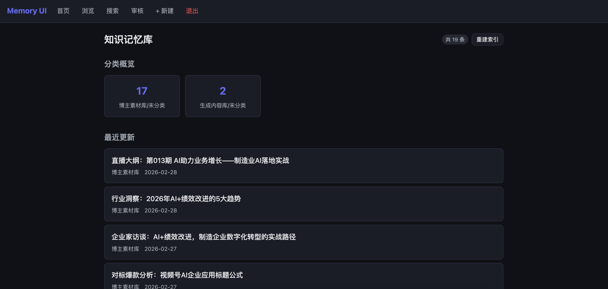
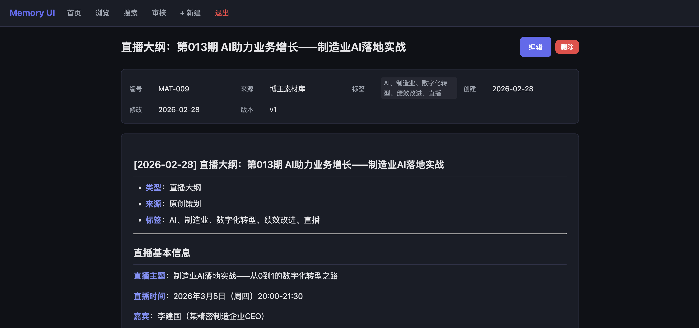
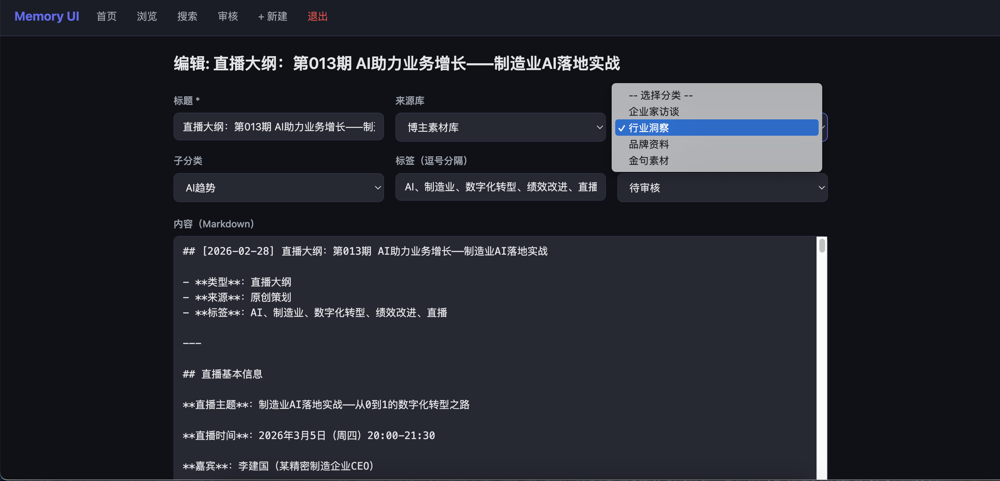
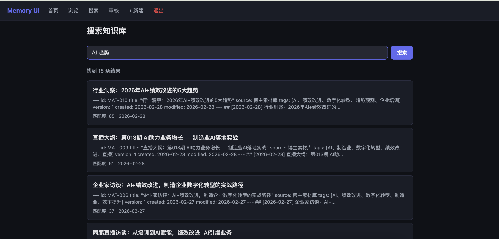
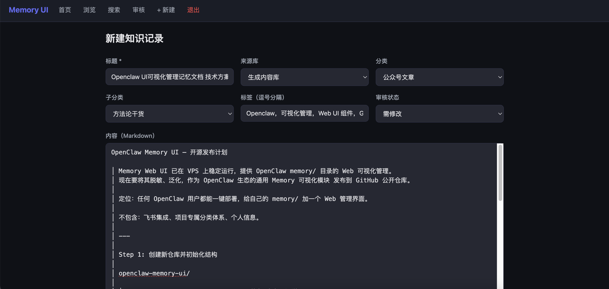
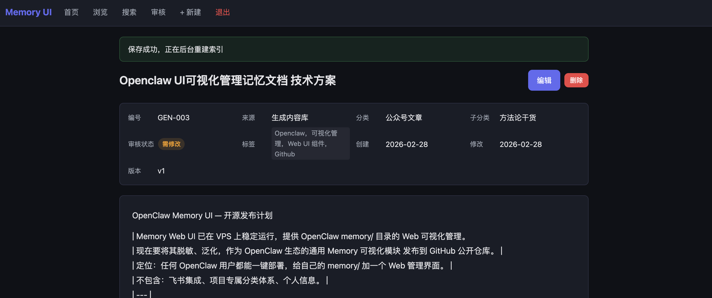

# Memory Web UI

A lightweight web interface for managing markdown knowledge base files. Browse, search, edit, and organize your `.md` files with a clean dark-themed UI.

**[中文说明](#中文说明)**

## Screenshots

| Home | View | Edit |
|------|------|------|
|  |  |  |

| Search | New Record | Detail View |
|--------|------------|-------------|
|  |  |  |

---

## Features

- **i18n Support** — English and Chinese out of the box; add your own language in `locales/`
- **Setup Wizard** — Run `python setup.py` to configure in 30 seconds
- **Folder Management** — Create, rename, delete folders to organize your knowledge base
- **Move & Batch Move** — Move files between folders, single or batch select
- **Browse & Search** — Navigate files by directory or full-text keyword search
- **Markdown Rendering** — View files with syntax highlighting and table of contents
- **YAML Frontmatter** — Edit metadata (title, tags, category, review status) via form UI
- **Review Workflow** — Optional approve/reject pipeline for content quality control
- **Customizable Categories** — Define your own category hierarchy via `categories.json`
- **Template Packs** — Pre-built category templates for AI agents, dev notes, and personal use
- **Auto Re-index** — Configurable post-edit command for search index rebuilds
- **Dark Theme** — Responsive design that works on desktop and mobile
- **Simple Auth** — Password-protected with configurable session lifetime
- **Nginx Ready** — Built-in reverse proxy support for sub-path deployment

## AI Agent Auto-Install

Have an AI assistant (e.g. OpenClaw, Claude, GPT)? Just send it this message:

> Install Memory Web UI on my VPS. Docs: https://github.com/YIING99/openclaw-memory-ui/blob/main/AGENT_INSTALL.md — password: YOUR_PASSWORD, language: zh

The repo includes `AGENT_INSTALL.md` (step-by-step guide for AI agents) and `memory-ui.json` (machine-readable manifest) so any capable AI agent can auto-install it.

## Quick Start

```bash
# 1. Clone
git clone https://github.com/YIING99/openclaw-memory-ui.git
cd openclaw-memory-ui

# 2. Run setup wizard
python setup.py

# 3. Install dependencies
pip install -r requirements.txt

# 4. Run
python app.py
# Visit http://127.0.0.1:5000
```

## Configuration

All settings are controlled via environment variables. Run `python setup.py` for interactive setup, or copy `.env.example` to `.env` and customize:

| Variable | Default | Description |
|----------|---------|-------------|
| `LANGUAGE` | `en` | UI language (`en`, `zh`, or add your own) |
| `MEMORY_DIR` | `~/memory` | Path to your markdown files directory |
| `MEMORY_UI_PASSWORD_HASH` | sha256("changeme") | SHA256 hash of your password |
| `MEMORY_UI_SECRET_KEY` | (default) | Flask session secret key |
| `SESSION_LIFETIME_HOURS` | `72` | Session expiry in hours |
| `APP_TITLE` | `Memory UI` | Brand name shown in navbar & login |
| `APP_SUBTITLE` | `Markdown Knowledge Base` | Subtitle shown in footer & login |
| `ENABLE_REVIEW` | `true` | Enable review workflow (`true`/`false`) |
| `REVIEW_STATUSES` | `pending,in_review,...` | Comma-separated review status values |
| `APPROVED_STATUSES` | `approved,published` | Which statuses count as "approved" |
| `DRAFTS_FOLDER` | `drafts` | Folder name for drafts |
| `REINDEX_COMMAND` | (empty) | Shell command to run after edits |
| `REINDEX_TIMEOUT` | `120` | Re-index command timeout (seconds) |
| `OPENCLAW_DIR` | (empty) | Path to OpenClaw installation (if using) |
| `OPENCLAW_HOME` | `~` | HOME for re-index subprocess |

### Generate Password Hash

```bash
python3 -c "import hashlib; print(hashlib.sha256('yourpassword'.encode()).hexdigest())"
```

## Custom Categories

Edit `categories.json` to define your own category hierarchy:

```json
{
  "Notes": {
    "prefix": "NOTE",
    "categories": ["Technical", "Research", "Ideas"],
    "subcategories": {
      "Technical": ["Backend", "Frontend", "DevOps"]
    }
  }
}
```

Or use a pre-built template from `presets/`:
- **ai-agent** — AI agent memory knowledge base (Conversations/Knowledge/Learnings)
- **dev-notes** — Developer notes (Projects/TIL/References)
- **personal** — Personal knowledge base (Notes/Resources)

## Production Deployment

### With Gunicorn + Nginx

```bash
pip install -r requirements.txt
gunicorn -c gunicorn.conf.py app:app
```

See `deploy/` directory for:
- `deploy.sh` — Interactive deployment script
- `memory-ui.service` — systemd service template
- `nginx.conf` — Nginx reverse proxy configuration

### systemd Service

```bash
cp deploy/memory-ui.service ~/.config/systemd/user/
systemctl --user daemon-reload
systemctl --user enable --now memory-ui
```

## Use Cases

- **AI Agent Memory** — Manage knowledge files for [OpenClaw](https://github.com/nicepkg/openclaw) or other AI agent frameworks. Set `REINDEX_COMMAND` to rebuild your vector index after edits.
- **Dev Notes** — Personal technical knowledge base with full-text search
- **Content Pipeline** — Use the review workflow to manage content approval before publishing
- **Team Wiki** — Lightweight alternative to heavy wiki software for small teams

## Architecture

```
┌──────────┐     ┌─────────┐     ┌──────────────┐
│  Nginx   │────▶│ Gunicorn│────▶│  Flask App   │
│ (proxy)  │     │ (WSGI)  │     │  (app.py)    │
└──────────┘     └─────────┘     └──────┬───────┘
                                        │
                    ┌───────────────────┼───────────────────┐
                    │                   │                   │
              ┌─────▼─────┐     ┌──────▼──────┐    ┌──────▼──────┐
              │ memory/   │     │ _index.json │    │  reindex    │
              │ *.md files│     │ (file index)│    │  (optional) │
              └───────────┘     └─────────────┘    └─────────────┘
```

## Adding a New Language

1. Copy `locales/en.json` to `locales/<code>.json`
2. Translate all values (keep keys unchanged)
3. Set `LANGUAGE=<code>` in `.env`

## License

MIT License. See [LICENSE](LICENSE).

## Author

KING

---

## 中文说明

Memory Web UI 是一个轻量级的 Web 界面，用于管理 Markdown 知识库文件。

### 功能特性

- **多语言支持** — 内置中英文，可自行添加更多语言
- **一键配置** — 运行 `python setup.py` 30 秒完成配置
- **文件夹管理** — 创建、重命名、删除文件夹，轻松组织知识库
- **文件移动** — 单个或批量选择文件，在文件夹间自由移动
- 浏览和搜索 .md 文件（支持子目录递归）
- Markdown 渲染预览（支持代码高亮、目录）
- 通过表单编辑 YAML frontmatter 元数据
- 可选的审核工作流（通过/驳回）
- 自定义分类体系（`categories.json`）+ 预设模板
- 深色主题，响应式设计，移动端友好
- 简单密码认证

### AI 助手一键安装

把下面这段话发给你的 AI 助手（OpenClaw 龙虾、Claude 等），即可自动安装：

> 帮我在 VPS 上安装 Memory Web UI。安装文档：https://github.com/YIING99/openclaw-memory-ui/blob/main/AGENT_INSTALL.md 密码设 YOUR_PASSWORD 语言用中文

### 快速开始

```bash
git clone https://github.com/YIING99/openclaw-memory-ui.git
cd openclaw-memory-ui
python setup.py   # 交互式配置向导
pip install -r requirements.txt
python app.py
# 访问 http://127.0.0.1:5000
```

### 配置

运行 `python setup.py` 进行交互式配置，或复制 `.env.example` 为 `.env` 手动修改。详见上方英文配置表。

### 从 v1.1 升级

如果你已在使用中文审核状态值，需要在 `.env` 中添加：

```env
LANGUAGE=zh
REVIEW_STATUSES=待审核,审核中,已通过,需修改,已发布
APPROVED_STATUSES=已通过,已发布
DRAFTS_FOLDER=草稿箱
```
